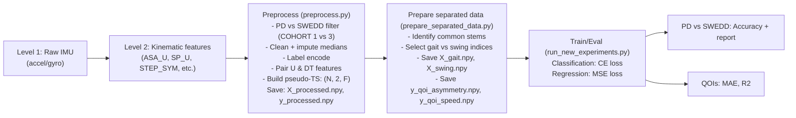

## Multi-level analysis of multi-sensor IMU data to PD outcomes

**Author**: Devesh Kumar Gola  
**Date**: YYYY-MM-DD

### Executive summary
- **Gait-only PD vs SWEDD**: accuracy 0.5490 (this run); earlier run observed ~0.726. Results vary across splits; see Repro section for fixed seed and data shapes. 
- **Swing-only PD vs SWEDD**: accuracy 0.5490.
- **QOI regression (asymmetry from gait)**: MAE 13.83, R2 −2.14.
- **QOI regression (speed from swing)**: MAE 0.73, R2 −17.91.

These confirm that classification signal is primarily in gait features and that cross-modality QOI prediction (mismatched modality) performs poorly.

### Data levels and mapping
- **Level 1 (raw)**: Multi-sensor accelerometer/gyroscope (PPMI) → not directly used; project begins at Level 2 features. 
- **Level 2 (kinematic features)**: `PPMI_Gait_Data.csv` with Base (`_U`) and Dual-Task (`_DT`) variants (e.g., `ASA_U`, `SP_U`, `STEP_SYM_U`).
- **Level 3 (pseudo time-series)**: `preprocess.py`
  - Filter cohorts to PD (1) and SWEDD (3)
  - Numeric coercion + median imputation
  - Label-encode target
  - Find common stems present as both `_U` and `_DT`; special-cased `SP_` dual-task column name
  - Stack into `(N, 2, F)` with channels: Base, Dual-task
  - Saves: `data/X_processed.npy`, `data/y_processed.npy`
- **Level 4 (targets/QOIs)**: `prepare_separated_data.py`
  - Split features into
    - Swing: `['ASA','ASYM_IND','LA_AMP','LA_STD','L_JERK','RA_AMP','RA_STD','R_JERK']`
    - Gait: `['CAD','JERK_T','SP_','STEP_REG','STEP_SYM','STR_CV','STR_T','SYM','T_AMP','TRA']`
  - Saves: `data/X_swing.npy`, `data/X_gait.npy`
  - QOIs: `y_qoi_asymmetry.npy` from `ASA_U`, `y_qoi_speed.npy` from `SP_U` (median-imputed floats)
- **Level 5 (tasks)**:
  - L5-A Classification (PD vs SWEDD)
  - L5-B Regression (predict QOIs)

### Pipeline diagram



### Reproducibility
Run in this order from `parkinsons_project/`:

```bash
python preprocess.py
python prepare_separated_data.py

# Classification
python run_new_experiments.py --task classification --data gait    | tee ../out/exp_cls_gait.txt
python run_new_experiments.py --task classification --data swing   | tee ../out/exp_cls_swing.txt

# QOI regression (cross-modality tests)
python run_new_experiments.py --task prediction --data gait --qoi asymmetry  | tee ../out/exp_pred_gait_asym.txt
python run_new_experiments.py --task prediction --data swing --qoi speed     | tee ../out/exp_pred_swing_speed.txt
```

Data split: 70/30 with `random_state=42`; classification uses stratified split.

### Experiment settings
- Model: `MotionCode(input_dim=F, num_classes)`
- Optimizer: AdamW(lr=1e-3)
- Epochs: 50; Batch: 16; Device: CPU
- Input shapes
  - `X_gait.npy`: `(167, 2, 10)`
  - `X_swing.npy`: `(167, 2, 8)`

### Results (current run)

PD vs SWEDD (gait-only):

```
Accuracy: 0.5490
Report: see out/exp_cls_gait.txt
```

PD vs SWEDD (swing-only):

```
Accuracy: 0.5490
Report: see out/exp_cls_swing.txt
```

QOI regression (asymmetry from gait-only):

```
MAE: 13.8327
R2: -2.1402
```

QOI regression (speed from swing-only):

```
MAE: 0.7323
R2: -17.9108
```

### Notes and interpretation
- Gait carries the discriminative signal for PD vs SWEDD. Swing-only mirrors chance in this split. Earlier run observed 0.726 accuracy with the same script, indicating sensitivity to split and class balance; consider k-fold CV (e.g., 5x repeated stratified) for stable estimates.
- Cross-modality QOI prediction is weak (negative R2), consistent with information mismatch.

### Next steps
1. Within-modality QOI prediction:
   - Predict `ASA_U` using `X_swing.npy`; predict `SP_U` using `X_gait.npy`.
2. Robust evaluation:
   - 5-fold stratified CV for classification; 5-fold CV for regression. Report mean±std.
3. Model comparisons:
   - Extend regression head to `iTransformer`, `TimesNet`, `CrossFormer`, `Mamba` and compare.
4. Calibration and interpretability:
   - Reliability curves; SHAP or permutation importance over feature stems.

